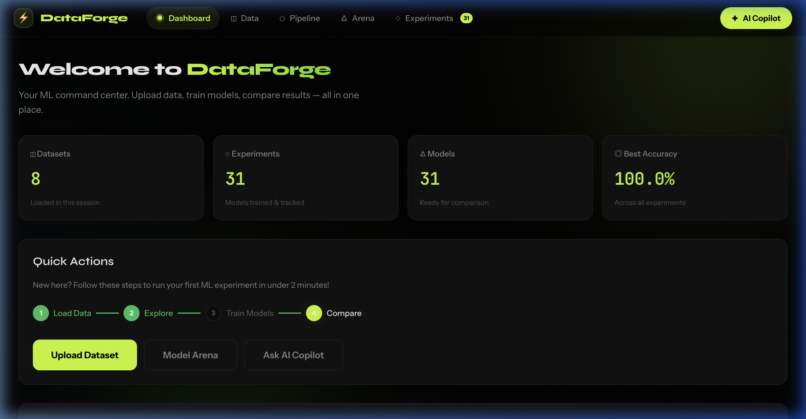
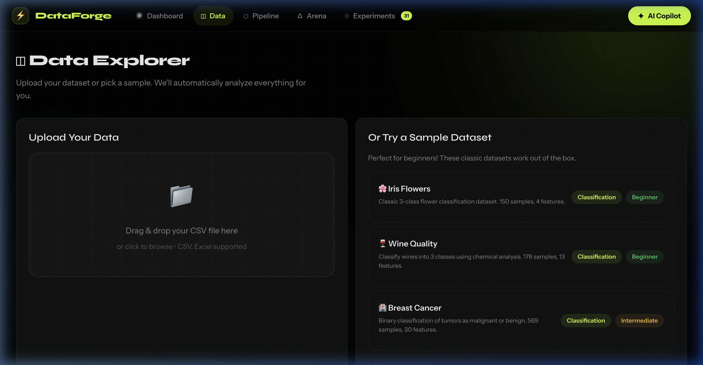
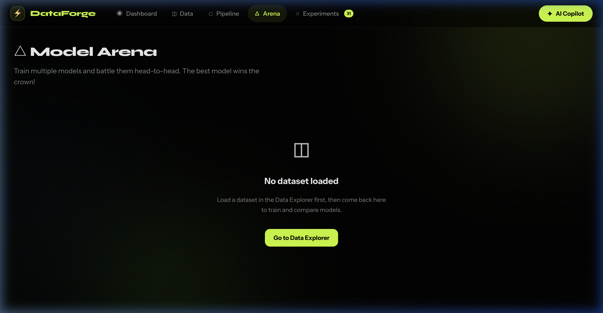
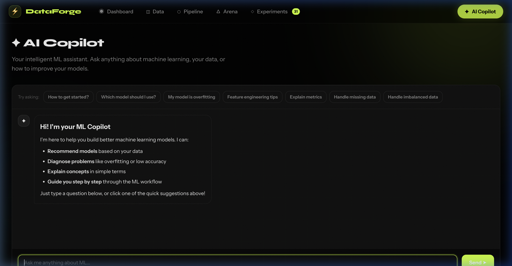

<div align="center">

# ⚡ DataForge

### ML Experimentation Platform

**Upload data. Train models. Compare results. Get AI guidance — all in one place.**

[](https://python.org)
[](https://fastapi.tiangolo.com)
[](https://scikit-learn.org)
[](https://xgboost.readthedocs.io)
[](https://groq.com)

</div>

---

<div align="center">
  
  <br><br>
</div>

## What is DataForge?

DataForge is a **full-stack ML experimentation platform** designed for data scientists and ML beginners. It provides an end-to-end workflow — from uploading and exploring your data to training 12+ machine learning models head-to-head and tracking every experiment.

Built with a **deep black canvas** aesthetic, **electric lime (`#C8FF00`)** accent, and glassmorphism-inspired UI using **Syne** and **Instrument Sans** typography.

---

## Features

<table>
<tr>
<td width="50%">

### Data Explorer
Upload CSV/Excel files or pick from built-in datasets (Iris, Wine, Breast Cancer, Diabetes). Automatic EDA with quality scoring, column profiling, missing value analysis, correlation heatmaps, and feature distributions.

</td>
<td width="50%">



</td>
</tr>
<tr>
<td width="50%">



</td>
<td width="50%">

### Model Arena
Train 10+ models head-to-head: Random Forest, XGBoost, LightGBM, Gradient Boosting, SVM, KNN, Naive Bayes, AdaBoost, Logistic Regression, Decision Tree. Visual leaderboard with accuracy, F1, precision, recall, AUC-ROC, confusion matrices, and feature importance charts.

</td>
</tr>
<tr>
<td width="50%">

### AI Copilot
Groq-powered LLM assistant (Llama 3.3 70B) that understands your loaded dataset context. Get model recommendations, diagnose overfitting, explain metrics in simple terms, and receive step-by-step ML guidance.

</td>
<td width="50%">



</td>
</tr>
</table>

### Additional Features

| Feature | Description |
|---------|-------------|
| **Pipeline Builder** | Visual preprocessing pipeline — handle missing data, encode features, scale, remove outliers |
| **Experiment Tracker** | Every model run is auto-logged with metrics, parameters, cross-validation scores, and timestamps |
| **Dashboard** | Real-time stats, recent experiments, guided onboarding with step-by-step progress |
| **Responsive UI** | Works on desktop and mobile with glassmorphism top nav and smooth micro-animations |

---

## Quick Start

### 1. Clone & Install

```bash
git clone https://github.com/Alphabeast1707/ML-Experimentation-platform.git
cd ML-Experimentation-platform
pip install -r requirements.txt
```

### 2. Configure (Optional)

```bash
cp .env.example .env
# Add your Groq API key for the AI Copilot (optional — app works without it)
```

### 3. Run

```bash
python -m backend.main
```

Open **http://localhost:8000** → done.

---

## Architecture

```
ML-Experimentation-platform/
├── backend/
│   ├── main.py                    # FastAPI app + all API routes
│   └── core/
│       ├── data_processor.py      # EDA engine, transforms, sample datasets
│       ├── ml_engine.py           # 12+ ML models, metrics, comparison
│       ├── experiment_tracker.py  # Run logging & persistence
│       └── ai_copilot.py          # Groq LLM integration + fallback
├── frontend/
│   ├── index.html                 # SPA shell with fixed glassmorphism nav
│   ├── css/
│   │   ├── globals.css            # Design tokens, typography, textures
│   │   ├── components.css         # All UI component styles
│   │   └── animations.css         # Keyframe animations & micro-interactions
│   └── js/
│       ├── app.js                 # SPA router & navigation
│       ├── api.js                 # API client layer
│       ├── utils.js               # Shared utilities & app state
│       └── pages/                 # Page modules
│           ├── dashboard.js       # Stats, quick actions, onboarding
│           ├── data.js            # Upload, EDA, preview
│           ├── pipeline.js        # Preprocessing pipeline builder
│           ├── arena.js           # Model training & comparison
│           ├── experiments.js     # Experiment log & details
│           └── copilot.js         # AI chat interface
├── requirements.txt
└── .env.example
```

## Supported Models

| Classification | Regression |
|---------------|------------|
| Logistic Regression | Linear Regression |
| Decision Tree | Ridge / Lasso |
| Random Forest | Decision Tree |
| Gradient Boosting | Random Forest |
| XGBoost | Gradient Boosting |
| LightGBM | XGBoost / LightGBM |
| SVM | SVR |
| KNN | KNN |
| Naive Bayes | — |
| AdaBoost | AdaBoost |

## Tech Stack

| Layer | Technology |
|-------|-----------|
| **Backend** | FastAPI, Python 3.9+, Uvicorn |
| **ML** | Scikit-learn, XGBoost, LightGBM, NumPy, Pandas |
| **AI** | Groq API (Llama 3.3 70B) |
| **Frontend** | Vanilla JS SPA, CSS design system, Syne + Instrument Sans |
| **Design** | Deep black canvas, electric lime (#C8FF00), glassmorphism, noise texture |

---

## Design Philosophy

- **Deep black canvas** (`#06060b`) with subtle grid pattern and noise texture overlay
- **Electric lime** (`#C8FF00`) as the sole brand accent — intentionally bold
- **Syne** for display headings, **Instrument Sans** for body — distinctive, never generic
- **Glassmorphism** top navigation with backdrop blur
- **Professional geometric icons** — no cartoon emojis, clean Unicode symbols throughout
- **Micro-animations** on every interaction — hover, focus, page transitions

---

<div align="center">

**Made with precision by Harshit & Aditya**

</div>
